# Company Employment Manager 

## Description

This is a command line app that uses Inquirer and MYSQL to create a CMS intended for department and employee management. To see a video of how it works and a demonstration of it used together with the mysql workbench, please click here: <https://drive.google.com/file/d/1XqFGUEvawcVPoKijm9yJnUe5JoBxZ4-q/view?usp=sharing>

## Table of Contents

- [Installation](#installation)
- [Usage](#usage)
- [License](#license)
- [Contributing](#contributing)
- [Questions](#questions)

## Installation

If you'd like to use the employee tracker, please clone my repo. Make sure you have node.js installed on your computer. You can find the download here <https://nodejs.org/en/download/>. Run npm install to install all dependencies.

## Usage

This app is intended for use by an HR department to add and manage employees within all the different departments of a company. Start it by typing in node index.js.

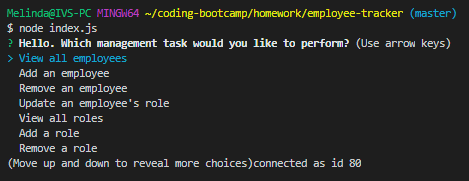

Using the app, you can:

View all employees

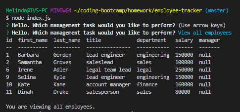

Add an employee

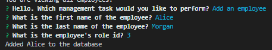

Remove an employee

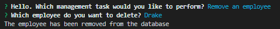

Update an employee's role

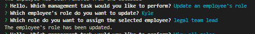

View all roles

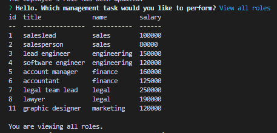

Add a role

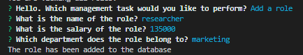

Remove a role

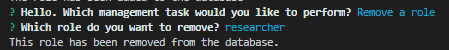

View all departments

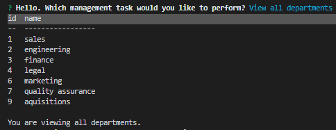

Add a department

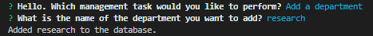

Remove a department

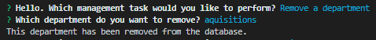

Quit

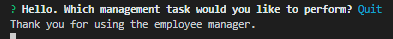

## License

GNU General Public License v3.0

The GNU License allows the software to be modified and distributed by other users. It does not impose any restrictions on the use of the software but requires that it remain open source.

## Contributing

Please contribute to this project if you feel that you can make the code more efficient or if you'd like to add more questions for the user. Create your own branch from the Master and submit a pull request. I ask that you follow the Contributor Covenant code of conduct: <https://www.contributor-covenant.org/version/2/0/code_of_conduct/code_of_conduct.md> 

## Questions

- [Github Profile](https://github.com/melindawinter)
- melindawinter42@gmail.com
- Please email me or connect with me on Linked In: <http://www.linkedin.com/in/melinda-winter-34a25689>.
